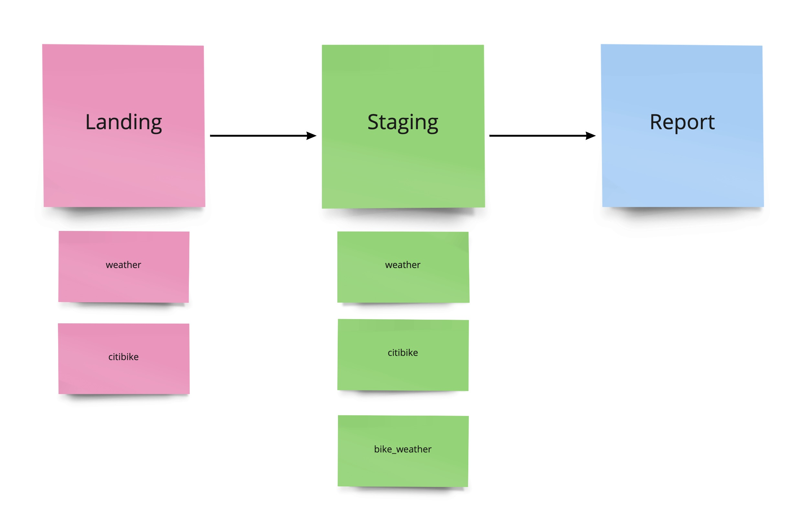
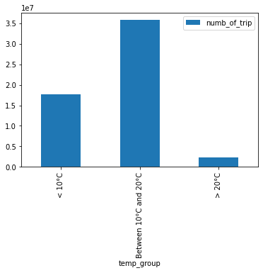

# :shipit: Data Engineer Pet Project :shipit:

Pet project, that shows my **Data Engineer** skills. The goal of the project is better understanding of your skills and
experience in the Data and Software Engineering field as well as see how you approach certain questions and challenges.

## Agenda

- [Description](#description)
- [Documentation](#documentation)
- [Implementation](#implementation)

## Description

### Requirements/Restrictions :exclamation:

* You can use any programming language (our recommendation is Python)
* The solution should be flexible, stable and scalable as well as ensure a good code quality (we
  want to bring this into production as a next step)
* We don't expect you to spin up any costly machines in the cloud or elsewhere to process
  Gigabytes or Terabytes of data!
* Unless stated otherwise, you can use any tool from one of the major cloud providers or any
  other system that you like

### Assignment:

* Ingestion:
    * Load one of the datasets from below onto your laptop or any other system (e.g. HDFS, Database, etc.). Keep it
      simple, only load as much data as you can process with your system of choice (e.g. load a week or month worth of
      data).
    * Download a weather dataset for the same timeframe as the above dataset, so that you can later join the two
      datasets
* Preparation/Data Cleansing:
    * How can we ensure quality of the data? What checks could be implemented? Implement a simple method to ensure the
      date/timestamp is in the right format throughout the datasets.
* Processing:
    * Join the two datasets, so that we know the weather for each entry in the main dataset.
* Analysis (optional):
    * Run a small analysis of your choice on the data (e.g. table, chart, map, etc.).Here are some ideas for the
      analysis part:
        * Impact of weather on the ridership of taxis, bikes, etc.
        * How many customers per day, hour or weekday?
        * ...

### Possible Datasets:

- New York City Bike Share: https://www.citibikenyc.com/system-data (Stream + History)
- New York City Taxi Trips: https://www1.nyc.gov/site/tlc/about/tlc-trip-record-data.page
  (History)
- Feel free to pick another interesting dataset if you like

## Documentation

#### Data Engineer Pet Project

|  Project Name   | **Data Engineer Pet Project**                  |
|-----|------------------------------------------------|
|   Category  | Pet project                                    |
|  Description   | project of processing and analyzing 2 datasets |
|  Tech stack   | Hadoop HDFS, PySpark                           |
|  Office   | None                                           |
|  Status   | In progress                                    |
|  ETA   | 30.09.2022                                     |

#### Team

|  Name           | Role   | Type     | Availability | Location         | Time Zone     |
| --------------  |--------| ------   |--------------|------------------|---------------|
| Karim Safiullin | Data Engineer | on bench | full time    | Germany, Ilmenau | CEST (UTC +2) |

#### Project implementation plan

1. write plan to develop app (plan + architecture) - **2h**
2. find, download, peek on datasets - **2h**
3. setup hadoop/yarn/spark locally on laptop - **2h**
4. upload to db/hdfs locally if resources are available - **3h**
5. setup environment, logging, `basement` of application etc - **4h**
6. implement cleansing logic (date format etc...) - **4h**
7. join 2 datasets using PySpark or another technologies - **3h**
8. find anomalies, dependencies, statistics and other things - **5h**
9. implement unit tests - **3h**

#### Report

Time estimate - **28h**
Actual time spent - #TODO

## Implementation

The structure of datalake storage consists of several `stages`.



(with my comments/reflections)

### Installation

1. load repository
    ```shell
        https://github.com/BondaiKa/image_denoising.git
    ```
2. Install packages locally or use virtualenv
   ```schell
   pip install -r requirements.txt
   ```
3. To run whole pipeline use command below:
    #TODO: implement
    ```shell
        bash scripts/run-all.sh
    ```
4. To run particular command use data-engineer-pet-project-cli.py as example below:
    ```shell
        python3 data-engineer-pet-project-cli.py  load-citibike-dataset-locally-cli --date "2022-04-30"
    ```

### Analysis

Dependency between bike trip and temperature


